[](https://nodei.co/npm/google-sheet-apis)

# google-sheet-apis

# How to use it

## 1. Install the package

### npm

```sh
npm install google-sheet-apis
```

### yarn

```sh
yarn add google-sheet-apis
```

## 2. Set up to access Google Sheet API

### 2.1 Create a new project in Google Console

Go to [Google Console](https://console.cloud.google.com/) >> Select a project >> NEW PROJECT >> Type your project's name >> CREATE

<details>
<summary>Show steps</summary>
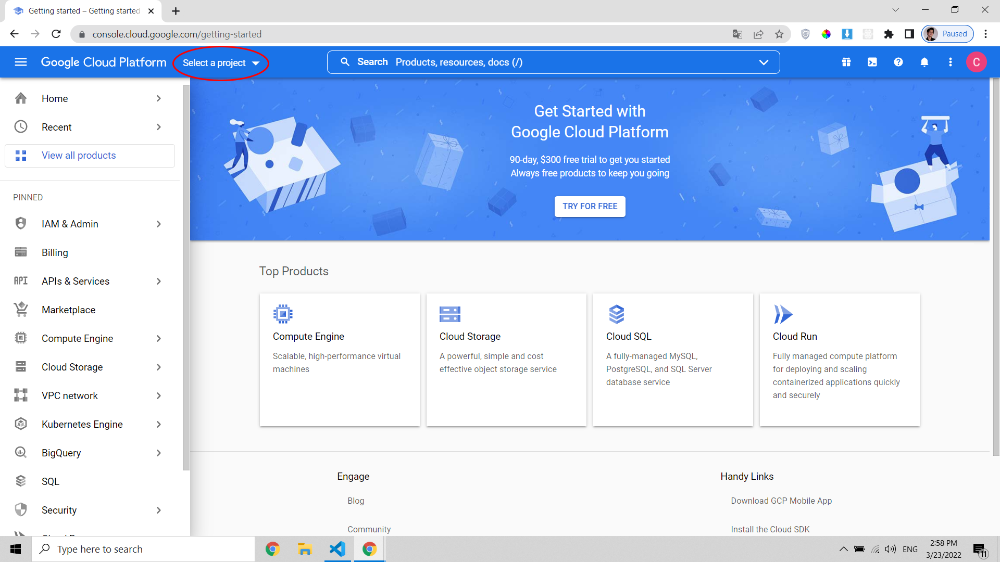
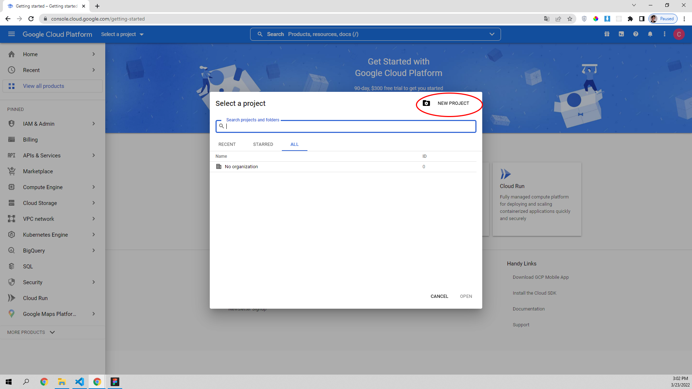
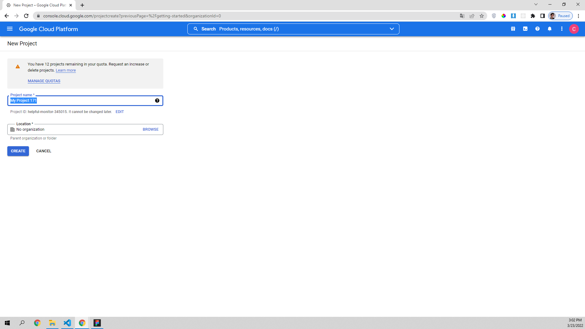
</details>
<br />

### 2.2 Enable Google Sheets API

Select your project >> Search: Google Sheet API >> ENABLE

<details>
<summary>Show steps</summary>
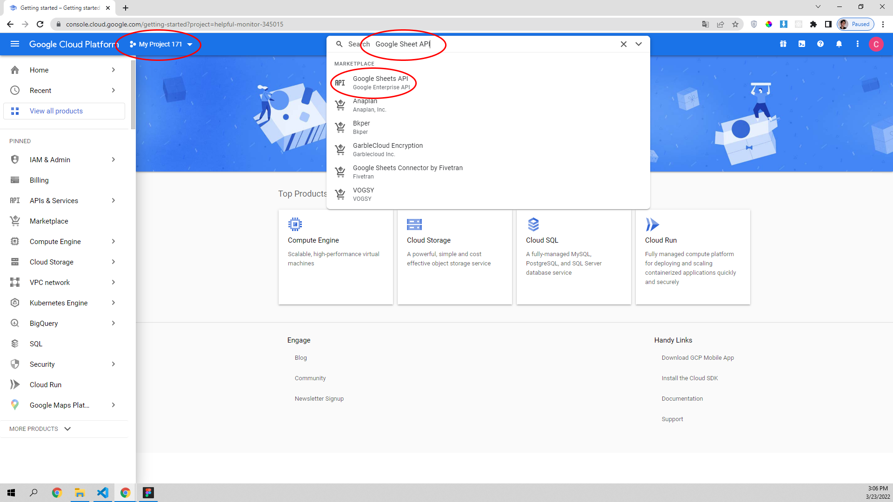
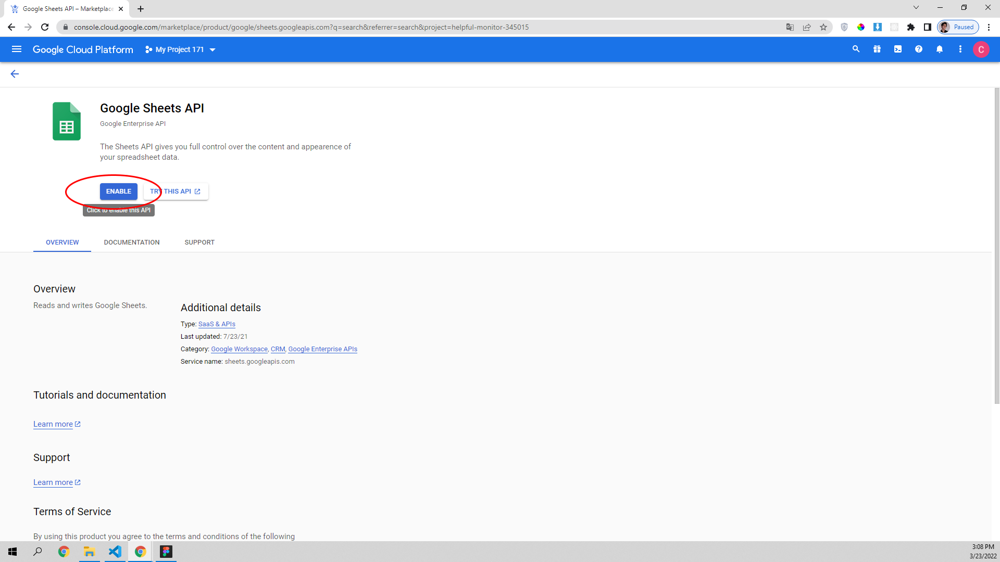
</details>
<br />

### 2.3 Create Service Accounts Credentials

Credentials >> + CREATE CREDENTIALS >> Service account >> Type your service'name >> CREATE AND CONTINUE >> CONTINUE >> DONE

<details>
<summary>Show steps</summary>
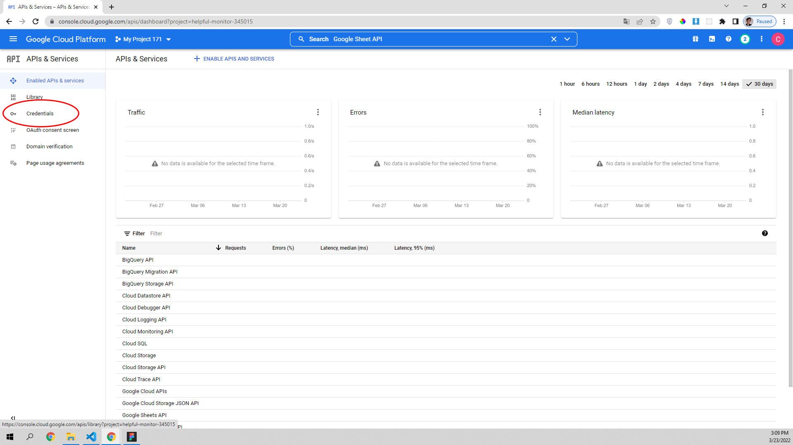
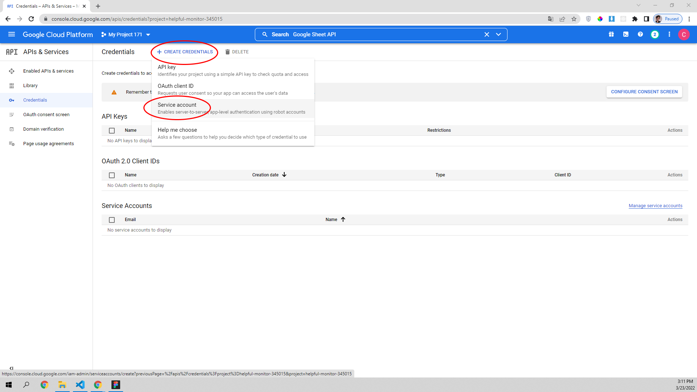
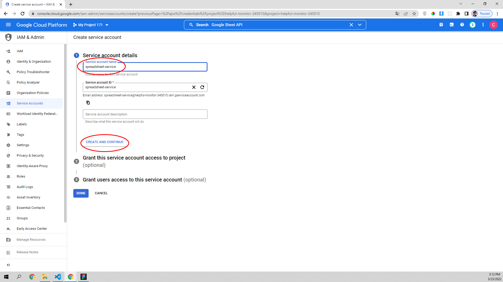
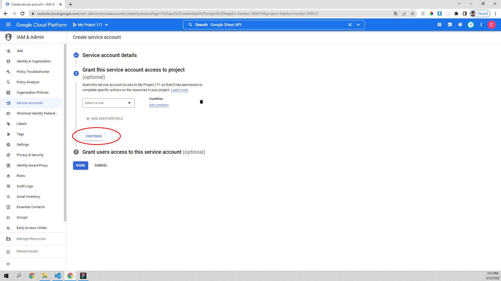
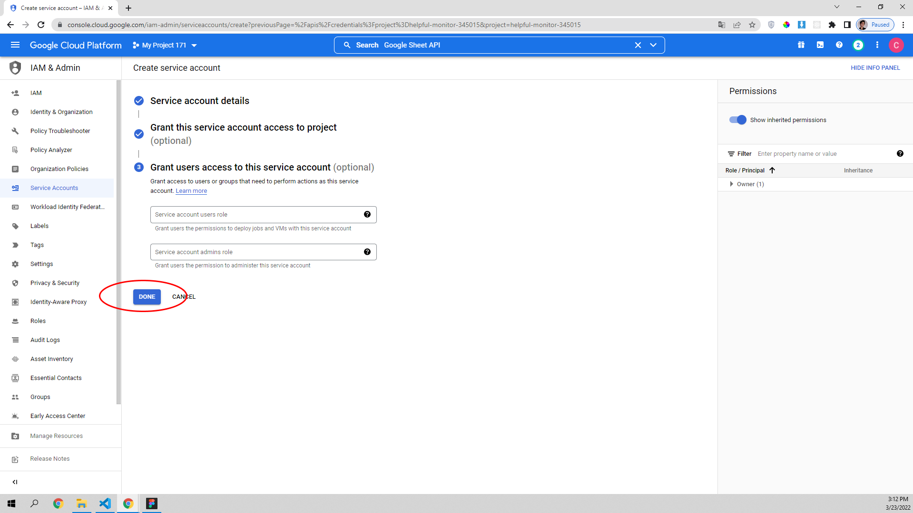
</details>
<br />

### 2.4 Add JSON keys

Click on the email in Service Accounts >> KEYS >> ADD KEY >> Create new key >> JSON >> CREATE >> The key will be downloaded in your machine

<details>
<summary>Show steps</summary>
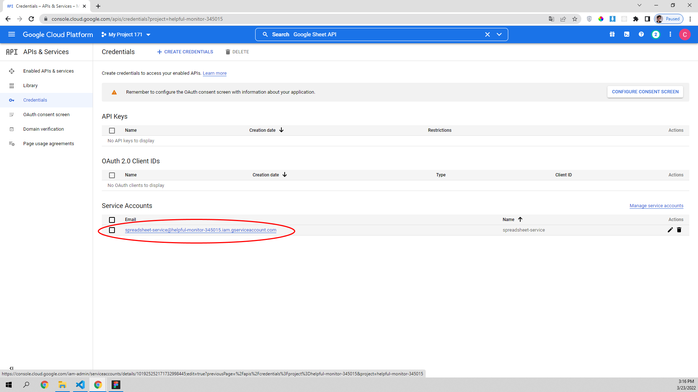
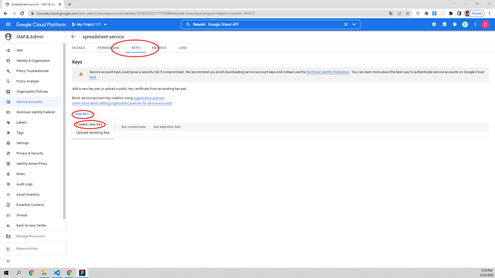
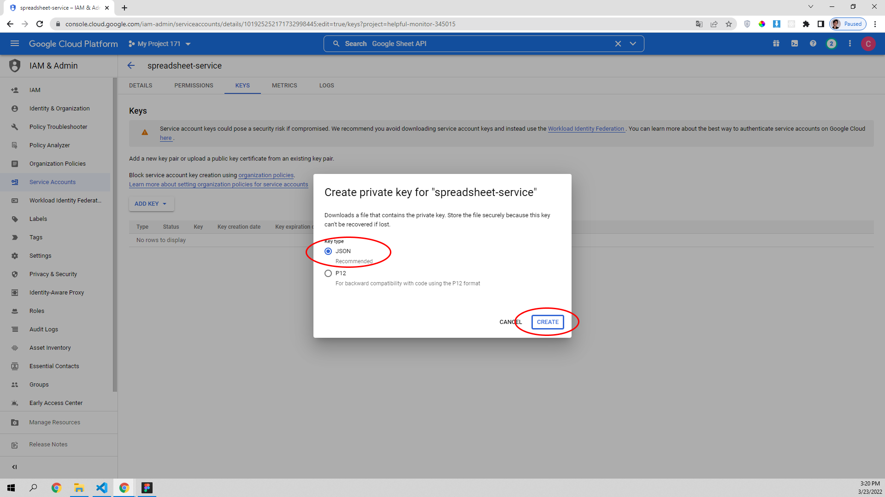
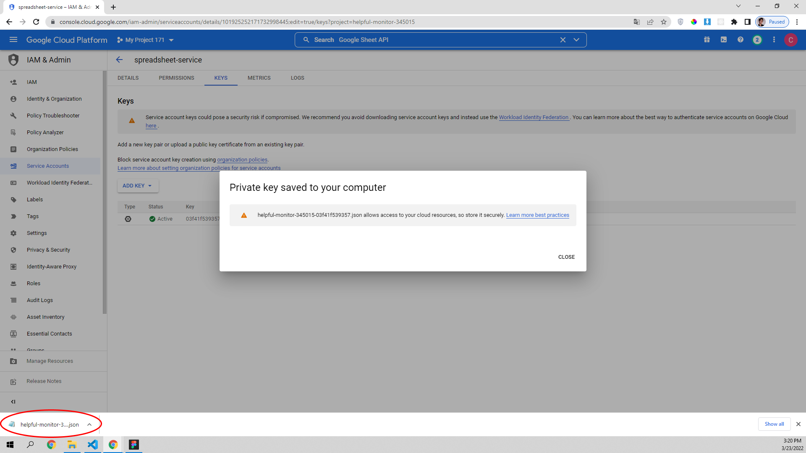
</details>
<br />

## 3. Example to use the package
